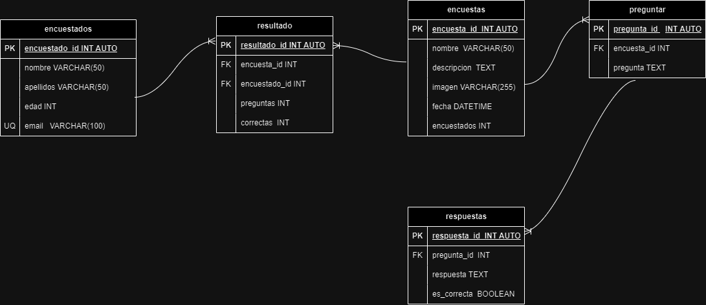

# Encuestas

## Listado de Entidades

### encuestas (Entidad de dato)

- encuesta_id **PK**
- nombre
- descripcion
- imagen
- fecha
- encuestados

### preguntar (Entidad de datos)

- pregunta_id **PK**
- encuesta_id **FK**
- pregunta

### respuestas (Entidad de datos)

- respuesta_id **PK**
- pregunta_id **FK**
- respuesta
- es_correcta

### encuestaods (Entidad de datos)

- encuesado_id **PK**
- nombre
- apellidos
- edad
- email **UQ**

### resultado (Entidad de datos/Entidad pivote)

- resultado_id **PK**
- encuesta_id **FK**
- encuestado_id **FK**
- preguntas
- correctas

## Relaciones

1. Una **encuesta** tiene **preguntas** (_1 a M_).
1. Una **pregunta** tiene **respuestas** (_1 a M_).
1. Una **encuesta** tiene **resultados** (_1 a M_).
1. Un **encuestado** tiene **resultados** (_1 a M_).

## Diagrama

## Reglas de negocio

### encuestados

1. Crear una encuesta.
1. Leer todas las encuestas.
1. Leer una encuesta en particular.
1. Actualizar una encuesta.
1. Aumentar en 1 el valor atrbuto encuestados cada que un encuestado complete la encuesta.

### preguntas

1. Crear una pregunta.
1. Leer todas las preguntas.
1. Leer una pregunta en particular.
1. Actualizar una pregunta.
1. Eliminar una pregunta.

### respuestas

1. Crear una respuesta.
1. Leer todas las respuestas.
1. Leer una respuesta en particular.
1. Actualizar una respuesta.
1. Eliminar una respuesta.

### encuestados

1. Crear un encuestado.
1. Leer todos los encuestados.
1. Leer un encuestado en particular.
1. Actualizar un encuestado.
1. Eliminar un encuestado.
1. Antes de crear un encuestados, verificar a través de su email que no exista

### resultados

1. Crear resultado.
1. Leer todos los resultados.
1. Leer un resultado en particular.
1. Actualizar un resultado.
1. Eliminar un resultado.
1. Sacar el porcentaje de asertividad que tuvo el encuestado al contestar la encuesta.
