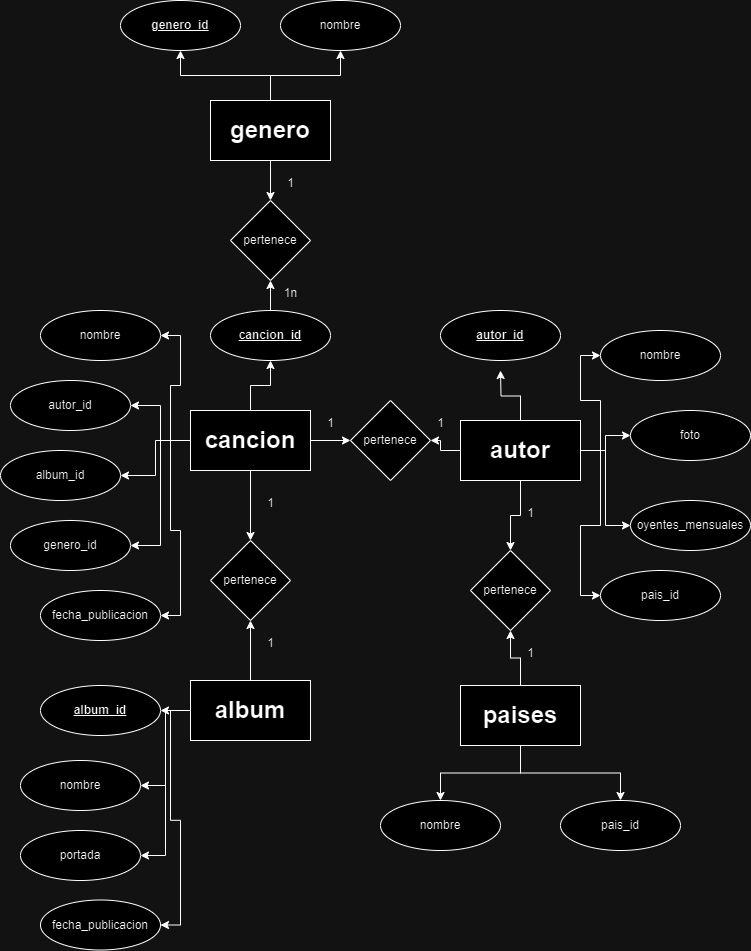
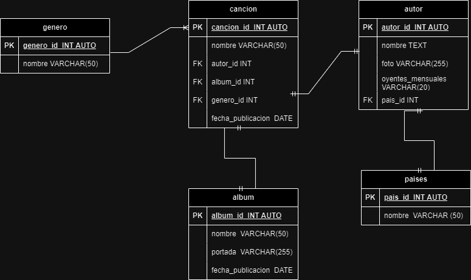

## Entidades

### cancion **(Entidad tipo Dato)**

- cancion_id **PK**
- nombre
- autor_id **FK**
- album_id **FK**
- genero_id **FK**
- fecha_publicacion

### autor **(Entidad tipo Catálogo)**

- autor_id **PK**
- nombre(s)
- foto
- oyentes_mesuales
- pais_id **FK**

### album **(Entidad tipo Catálogo)**

- album_id **PK**
- nombre
- portada
- fecha_publicacion

### genero **(Entidad tipo Catálogo)**

- genero_id **PK**
- nombre

### paises **(Entidad tipo Catálogo)**

- pais_id **PK**
- nombre

## Relaciones del sistema

1. **canción** pertenece a un **autor** (_1 a 1_)
1. **canción** pertenece a un **album** (_1 a 1_)
1. **canción** pertenece a un **genero** (_1 a M_)
1. el **autor** tiene un **pais** de origen (_1 a 1_)

## Diagramas

### Modelo Entidad - Relación

### Modelo Relacional de la BD

## Modelo de negocio

### canciones

1. Crear una canción
1. Leer todas las canciones de la entidad canciones
1. Leer una canción en particular dada una condición
1. Actualizar una canción dada una condición en particular
1. Eliminar una canción dada una condición en partiuclar

### autor

1. Crear un autor
1. Leer todas los autores de la entidad autor
1. Leer un autor en particular dada una condición
1. Actualizar un autor dada una condición en particular
1. Eliminar un autor dada una condición en partiuclar

### album

1. Crear un album
1. Leer todos los albumnes de la entidad album
1. Leer un album en particular dada una condición
1. Actualizar un album dada una condición en particular
1. Eliminar un album dada una condición en partiuclar

### paises

1. Crear un país
1. Leer todos los países de la entidad paises
1. Leer un país en particular dada una condición
1. Actualizar un país dada una condición en particular
1. Eliminar un país dada una condición en partiuclar
