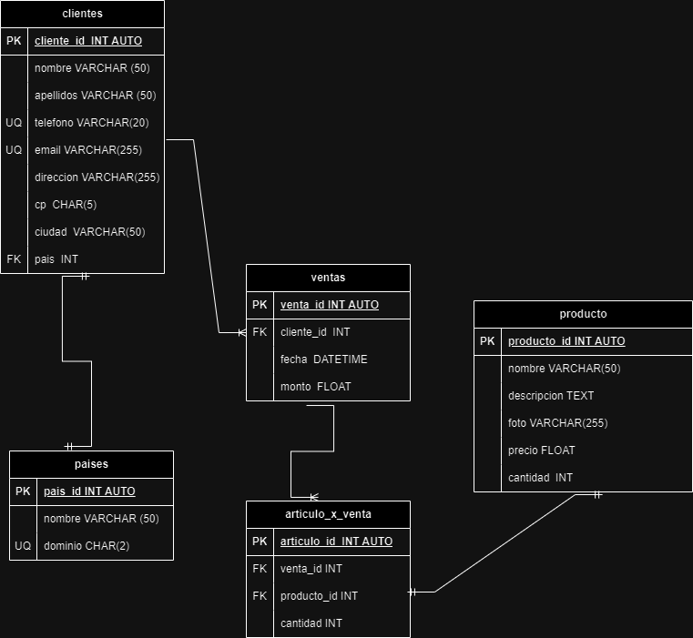

# Ventas

## Listado de Entidades

### clientes (Entidad de datos)

- cliente_id **PK**
- nombre
- apellidos
- telefono **UQ**
- email **UQ**
- direccion
- cp
- ciudad
- pais **FK**

### productos (Entidad Datos/Entidad Catálogo)

- producto_id **PK**
- nombre
- descripcion
- foto
- precio
- cantidad

### ventas (Entidad de Datos)

- venta_id **PK**
- cliente_id **FK**
- fecha
- monto

### articulo_x_venta **(Entidad pivote)**

- articulo_id **PK**
- venta_id **FK**
- producto_id **FK**
- cantidad

### paises (Entidad catálogo)

- pais_id
- nombre
- dominio **UQ**

## Relaciones

1. Un **cliente** tiene **país** (_1 a 1_)
1. Un **cliente** genera **ventas** (_1 a M_)
1. Una **venta** tiene **articulos** (_1 a M_)
1. Un **articulo** es un **producto** (_1 a 1_)

## Modelo Relacional de la BD

## Reglas de negocio

### clientes

1. Crear un cliente.
1. Leer todos los clientes.
1. Leer un cliente en particular.
1. Actualizar un cliente.
1. Eliminar un cliente.

### productos

1. Crear un producto.
1. Leer todos los productos.
1. Leer un producto en particular.
1. Actualizar un producto.
1. Eliminar un producto
1. Cada que haya una venta resta a la cantidad de productos disponibles, el número de artículos que se vendieron.

### ventas

1. Crear una venta.
1. Leer todas las ventas.
1. Leer una venta en particular.
1. Leer todas las ventas de un cliente.
1. Leer todas las ventas de un producto.

### articulos_x_ventas

1. Crear un artículo.
1. Leer todos los artículos.
1. Leer un artículo en particular.
1. Leer todos los artículos de un producto.
1. Leer todos los artículos de un cliente.
1. Actualizar un artículo.
1. Eliminar un artículo.

### paises

1. Crear un pais.
1. Leer todos los países.
1. Leer un país en particular.
1. Eliminar un país.
